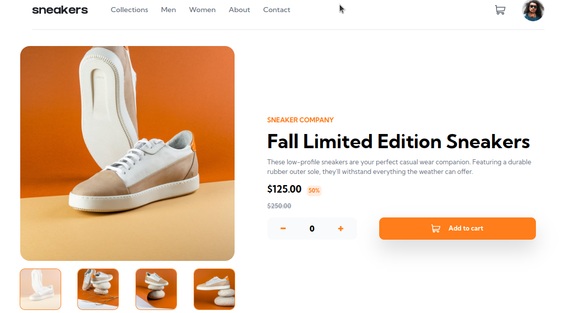

# Getting Started with Vue 3 + Vite

This project uses Vue 3 `<script setup>` SFCs, check out the [script setup docs](https://v3.vuejs.org/api/sfc-script-setup.html#sfc-script-setup) to learn more.

# Frontend Mentor - E-commerce product page solution | Telegram-bot-revolution

This is a solution to the [E-commerce product page challenge on Frontend Mentor](https://www.frontendmentor.io/challenges/ecommerce-product-page-UPsZ9MJp6). Frontend Mentor challenges help you improve your coding skills by building realistic projects.

## Table of contents

- [Overview](#overview)
  - [The challenge](#the-challenge)
  - [Screenshot](#screenshot)
  - [Links](#links)
- [My process](#my-process)
  - [Built with](#built-with)
- [Author](#author)

## Overview

### The challenge

Users should be able to:

- View the optimal layout for the site depending on their device's screen size
- See hover states for all interactive elements on the page
- Open a lightbox gallery by clicking on the large product image
- Switch the large product image by clicking on the small thumbnail images
- Add items to the cart
- View the cart and remove items from it

### Screenshot

### Links

- Solution URL: [Add solution URL here]()
- Live Site URL: [Add live site URL here](https://thriving-cascaron-1823bb.netlify.app/)

## My process

### Built with

- [Vite] (https://vitejs.dev/) - development server
- [Vue3](https://v3.vuejs.org/) - JS Framework
- [Tailwind CSS](https://tailwindcss.com/) - For Styling
- Mobile-first workflow

## Author

- GitHub - [@filimonkd ](https://github.com/filimonkd)